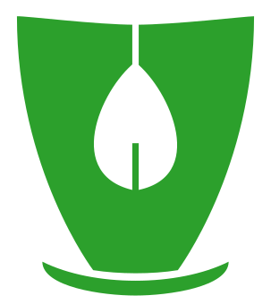

<a name="readme-top"></a>


<!-- PROJECT LOGO -->
<br />
<div align="center">
  <a href="https://github.com/FSchiltz/Thea">
    
  </a>

<h3 align="center">Thea</h3>

  <p align="center">
    Selfhosted tea timer with mqtt support
  </p>
</div>


<!-- TABLE OF CONTENTS -->
<details>
  <summary>Table of Contents</summary>
  <ol>
    <li>
      <a href="#about-the-project">About The Project</a>
      <ul>
        <li><a href="#built-with">Built With</a></li>
      </ul>
    </li>
    <li>
      <a href="#getting-started">Getting Started</a>
      <ul>
        <li><a href="#prerequisites">Prerequisites</a></li>
        <li><a href="#installation">Installation</a></li>
      </ul>
    </li>
    <li><a href="#contributing">Contributing</a></li>
    <li><a href="#license">License</a></li>
  </ol>
</details>

![product-screenshot]

<!-- ABOUT THE PROJECT -->
## About The Project

A simple selfhosted tea timer so you won't forget your infusion.
Supprts mqtt to notify to allows integration with many notification setups.


### Built With

* [![React][React.js]][React-url]
* [Bulma][Bulma-url]

<p align="right">(<a href="#readme-top">back to top</a>)</p>


<!-- GETTING STARTED -->
## Getting Started

### Installation
#### Bare metal
Comming soon

#### Docker compose minimal
1. Create the docker-compose.yaml file
```
version: "3.9"
volumes:
  - storage
services:
  web:
    image: ghcr.io/fschiltz/thea:main
    ports:
      - "80:80"
    volumes:
      - storage:/app/storage/

```

2. Run
```
docker compose up
```

#### Docker compose complete
1. Create the docker-compose.yaml file
```
version: "3.9"
volumes:
   - storage
services:
  web:
    image: ghcr.io/fschiltz/thea:main
    expose:
      - "80"

    volumes:
      - storage:/app/storage/
    env_file:
      - .env
```

2. Create the .env file
```
MQTT__HOST=test.com
MQTT__PORT=1883
MQTT__USERNAME=user
MQTT__PASSWORD=password
MQTT__TOPIC=Thea/Tea

Storage__Type=SQLLITE
Storage__Path=storage/db/
Storage__Username=user
Storage__Password=password
 ```
 
3. Run
```
docker compose up
```
4. Expose the service to your network with you reverse proxy ( and authentification solution if needed )

#### From source
  1. Clone the repo
  2. Install npm packages
  ```
  cd ./Thea/ClientApp
  npm install
  ```
  3. Run
  ```
  cd ../..
  dotnet run
  ```
  
#### From source (docker)
  1. Clone the repo
  2. run the docker
  ```
  docker compose build
  docker compose up
  ```
  3. Open http://localhost:80

<p align="right">(<a href="#readme-top">back to top</a>)</p>

<!-- CONTRIBUTING -->
## Contributing

Contributions are what make the open source community such an amazing place to learn, inspire, and create. Any contributions you make are **greatly appreciated**.

If you have a suggestion that would make this better, please fork the repo and create a pull request. You can also simply open an issue with the tag "enhancement".
Don't forget to give the project a star! Thanks again!

1. Fork the Project
2. Create your Feature Branch (`git checkout -b feature/AmazingFeature`)
3. Commit your Changes (`git commit -m 'Add some AmazingFeature'`)
4. Push to the Branch (`git push origin feature/AmazingFeature`)
5. Open a Pull Request

<p align="right">(<a href="#readme-top">back to top</a>)</p>


<!-- LICENSE -->
## License

Distributed under the MIT License. See `LICENSE.txt` for more information.

<p align="right">(<a href="#readme-top">back to top</a>)</p>


<!-- MARKDOWN LINKS & IMAGES -->
<!-- https://www.markdownguide.org/basic-syntax/#reference-style-links -->
[product-screenshot]: Images/screenshot.png
[React.js]: https://img.shields.io/badge/React-20232A?style=for-the-badge&logo=react&logoColor=61DAFB
[React-url]: https://reactjs.org/
[Bulma-url]: https://bulma.io/

